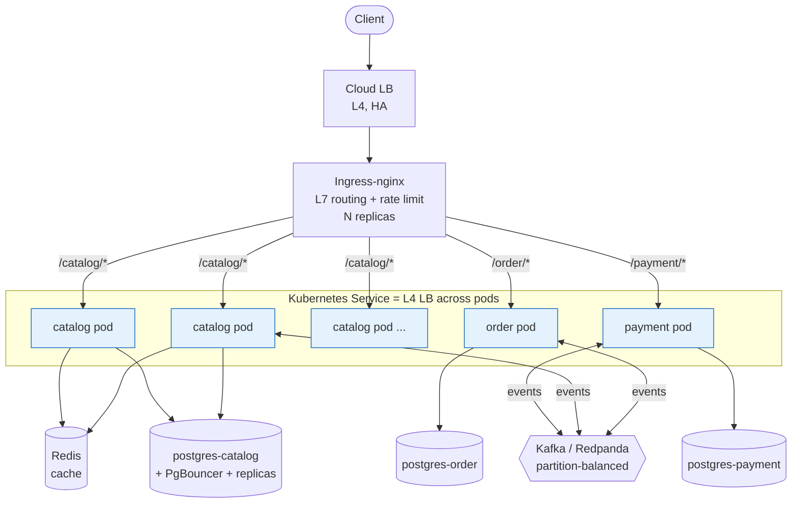
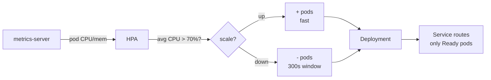
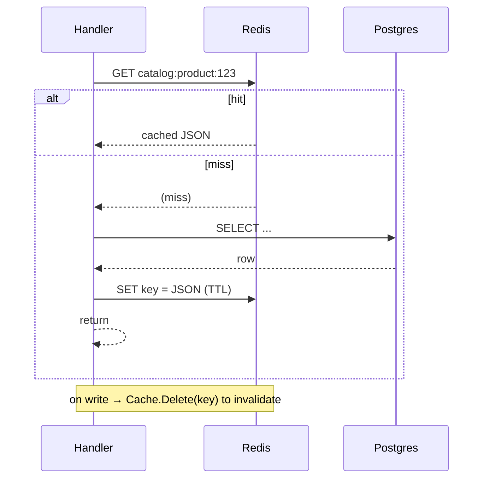
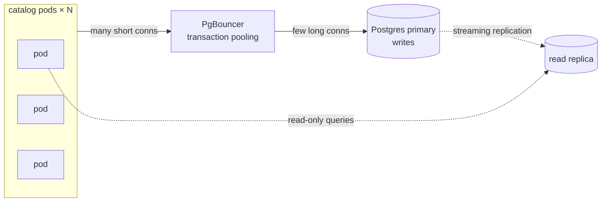
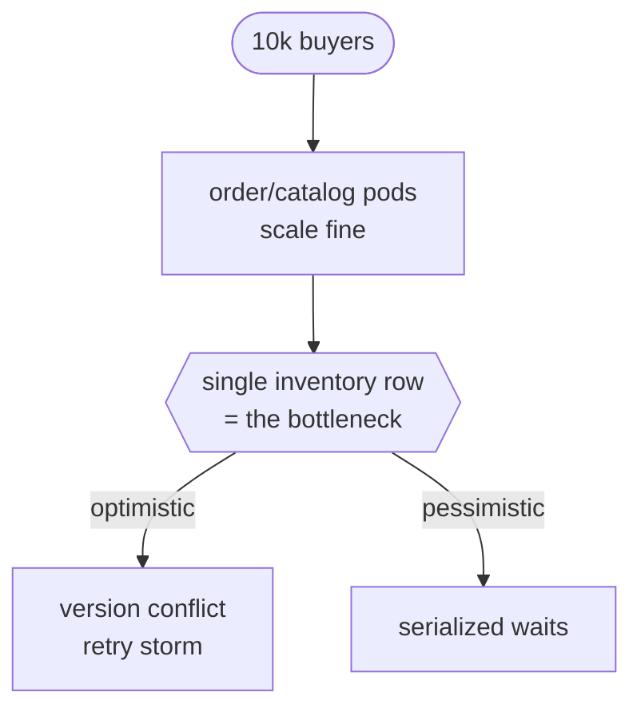
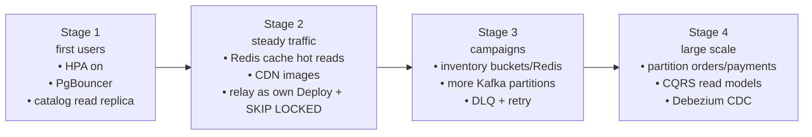

# ECOM-GOLANG — Scaling & Load Balancing

How this system scales, where the bottlenecks are, and how the Kubernetes setup
(`infra/k8s/`) and the Redis cache (`pkg/cache`) address them.

> TL;DR — the three services are **stateless** and scale horizontally with the
> HPA. The real limits you hit, in order, are **(1) inventory row contention →
> (2) outbox relay throughput → (3) database connections/writes**. Adding pods
> does not fix #1 or #3 — caching, PgBouncer and read replicas do.

---

## 1. Load-balancing layers

Traffic is balanced at four distinct layers, each by a different mechanism.



| Layer | Balanced by | In this repo |
| --- | --- | --- |
| ① Edge → ingress | Cloud LB (ALB/NLB) | managed; fronts the ingress controller |
| ② Ingress → service | ingress-nginx (L7, path-based) | `infra/k8s/50-ingress.yaml` |
| ③ Service → pods | k8s `Service` / kube-proxy (L4) | `Service` in each `4x-*.yaml` |
| ④ Consumer scaling | Kafka **consumer group + partitions** | not an HTTP LB — see §5 |
| ④ DB connections | **PgBouncer** + read replicas | planned — see §4 |

Because the services hold **no in-memory session** (JWT is verified per request),
**no sticky sessions** are needed — any pod can serve any request, so layer ③
balances freely. Algorithm: prefer `least_conn`-style for checkout (uneven cost),
round-robin is fine for catalog reads.

---

## 2. Horizontal autoscaling (HPA)

Each service has a `HorizontalPodAutoscaler` scaling on CPU **and** memory.
Resource **requests** are what the HPA's utilization % is measured against, so
they are set deliberately low (100m CPU) to let pods scale before saturation.



| Service | min | max | Why |
| --- | --- | --- | --- |
| catalog | 2 | 10 | read-heavy, highest traffic |
| order | 2 | 8 | checkout spikes |
| payment | 2 | 6 | bounded by external PSP throughput |

Scale-down uses a **300s stabilization window** to avoid flapping. Rolling
updates use `maxUnavailable: 0` + `maxSurge: 1` for zero-downtime deploys, and a
`PodDisruptionBudget` keeps ≥1 pod during node drains.

**Why this is safe here:** the readiness probe (`/readyz`) pings the DB, so the
`Service` only sends traffic to pods that can actually serve; graceful shutdown
(SIGTERM + 10s drain, already in each `main.go`) lets terminating pods finish
in-flight requests during scale-down.

---

## 3. Caching (Redis, cache-aside)

`pkg/cache` is a shared cache-aside helper. It is **optional**: an empty
`REDIS_ADDR` disables it and an unreachable Redis degrades to direct DB reads —
Redis is a performance layer, never required for correctness.



Usage (one line wraps an expensive read):

```go
p, err := cache.GetOrSet(ctx, rc, "product:"+id, 5*time.Minute,
    func(ctx context.Context) (Product, error) { return repo.FindProduct(ctx, id) })
```

**What to cache** (read-heavy, change-rarely): product detail, category tree,
exchange rates, vendor profiles. **Invalidate on write** with `rc.Delete(...)`.

**What NOT to cache**: inventory availability and anything money-authoritative —
stale stock causes oversell. Keep those reads on the DB (or a very short TTL with
care). Keys are namespaced per service (`catalog:`, `order:`...) so a shared
Redis never collides. Redis runs with `allkeys-lru` + no persistence: a cold
cache just causes a brief miss storm, not data loss.

---

## 4. Database scaling (the eventual hard limit)

DB-per-service lets each database scale independently. As service pods multiply,
the **connection count** is the first thing to break: `pkg/db` sets
`MaxOpenConns(20)` per pod, so 10 catalog pods = 200 connections to one Postgres
(default `max_connections` ≈ 100).



Roadmap, in the order you'll need it:

1. **PgBouncer** (transaction pooling) between pods and each DB — bounds
   connections regardless of pod count. *Do this before scaling pods past ~5.*
2. **Read replicas** for catalog (read:write ≈ 100:1); route read-only queries
   to replicas at the app layer.
3. **Partition** the always-growing tables (`orders`, `payments`, `audit_log`) —
   the schema already anticipates this.
4. **Shard** only if a single primary's write throughput is exhausted (far off).

---

## 5. Async scaling: Kafka & the outbox relay

HTTP load balancers do not balance event processing — **Kafka does, via
consumer groups and partitions**. Parallelism per topic ≤ partition count, so
provision partitions for future consumer fan-out up front (`aggregate_id` =
order id is the partition key, keeping each order's events ordered).

The **outbox relay** is the throughput bottleneck most teams miss: it polls the
`outbox` table and publishes to Kafka. Two rules to scale it:

- Poll with `SELECT ... FOR UPDATE SKIP LOCKED` so multiple relay workers never
  publish the same row.
- Run the relay as its **own process/Deployment**, not one-per-API-pod, or shard
  the poll by `hash(aggregate_id)`. At high volume, replace polling with
  **Debezium CDC** (reads the WAL directly).

If the relay can't keep up, `outbox` lag rises → events emit late → orders sit in
`PENDING`. Alert on **outbox lag** (`COUNT(*) WHERE sent_at IS NULL`) and on
**consumer lag**.

---

## 6. The e-commerce-specific bottleneck: inventory contention

This is the limit you hit **first**, and it is **not** solved by more pods. A
flash-sale on one SKU funnels thousands of reservations onto a single
`inventory` row. With optimistic locking (`version` column) that becomes a
retry storm; with pessimistic locks it serializes.



Mitigations, by severity:

| Traffic | Strategy |
| --- | --- |
| normal | optimistic lock + bounded retry (current) |
| moderate | `SELECT ... FOR UPDATE` pessimistic lock |
| flash sale | **split stock into N buckets** (rows) to spread contention |
| extreme | **Redis atomic decrement** (Lua) as the reservation gate, reconcile to DB async |

The Redis layer added here is the foundation for that last option.

---

## 7. Scaling roadmap (by traffic stage)



## 8. Still missing (tracked separately)

These are not yet implemented and matter for production scaling/operability:

- **PgBouncer** Deployment + app-side read/write split.
- **Outbox relay** implementation (`SKIP LOCKED`) + **DLQ / retry** policy.
- **Distributed tracing** (trace_id propagated through the `outbox.headers` field
  that already exists) + **metrics** (outbox lag, consumer lag, cache hit rate).
- **Saga timeout / orphan-order** sweeper.
